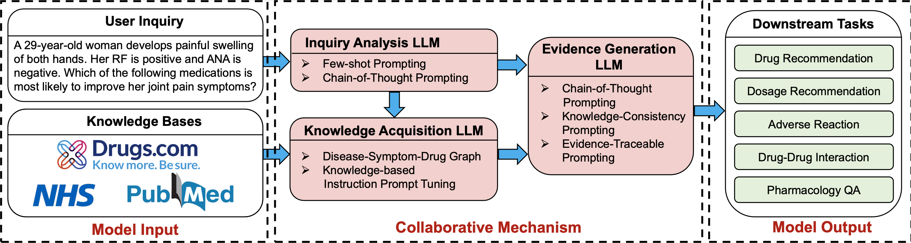

# DrugGPT
This repo contains the original implementation of our paper ***DrugGPT: A Knowledge-Grounded Collaborative Large Language Model for Evidence-based Drug Analysis***.


## Updates
[26/10/2023] We make all the codebases available!

[12/10/2023] We release our code on the pre-processing and generation of data and model. 

## Pre-trained Model
The trained model is available at [Google Drive](https://drive.google.com/file/d/1jyavc13OdwzVZaTDdo6oEm4_adjr_nO8/view?usp=sharing).

## Demo
To access the full model, visit our demo [DrugGPT Demo](https://demo-drug-gpt.vercel.app/en).

### Instruction on how to use the demo for drug analysis and inquiry

1. There are 4 modes accessible for downstream tasks: 
   1. General: This mode is intended for general drug inquiry. User is prompted to input symptom, disease (if diagnosed) and medication info (if prescribed). The model will generate information about the drug, including its name, usage, side effects, etc. This model is recommended for general conversation about drug and disease.
   2. Multiple Choice: This mode is intended for drug related multiple choice questions. User is prompted to input the question and the options. The model will generate the answer to the question. This mode is not recommended for continuous conversation but for accurate, evidence-based MC Q&A.
   3. Yes/No: This mode is intended for drug related yes/no questions. User is prompted to input the question. The model will generate the answer to the question. This mode is not recommended for continuous conversation but for accurate, evidence-based binary Q&A.
   4. Text Q&A: This mode is intended for drug related text Q&A. User is prompted to input the question. The model will generate the answer to the question. This mode is not recommended for continuous conversation but for accurate, evidence-based text Q&A.
2. After selecting the desired mode and inputting the information, click the 'Submit' button at the bottom of the form to initiate the conversation.
3. DrugGPT should never be used as medical consultant at the current stage. Please consult to licensed medical professionals for any medical advice.

### Demos on downstream tasks
The demo videos showing DrugGPT performing downstream tasks will be available at: 
1. [Multiple Choice Q&A](https://www.loom.com/share/6528968b9b804db19f5d7c5e1554197a?sid=6b6019e4-d8d5-46b3-bf7d-7c4895ec91bb)
2. [Drug and Dosage Recommendation](https://www.loom.com/share/81e82eb651bc4a208097e5f8dc56e28d?sid=a4ca2143-6e6f-48f0-9863-b6e691f40273)
3. [Adverse Reaction](https://www.loom.com/share/2b4b91726dfe4a38afe99a56cacd5170?sid=9f0e4480-0b60-48f9-909c-4f1f02c58a82)
4. [Drug-drug Interaction](https://www.loom.com/share/e0b43a02862248da937cd10b8c7b0284?sid=3eb53ad4-b248-46a0-8ce4-d1f17389071d)
5. [Pharmacology Q&A](https://www.loom.com/share/5dbac6d2cac9406da717db0572e9d5b6?sid=c8b2827d-533d-42af-ae16-88ecdbb35acc)
6. [Generalization Study](https://www.loom.com/share/cc7a476209a444fa851fd4b0bd1ea1fd?sid=18c0f238-1260-4af5-a557-4ca9fb04fef6)

## Clone the repo
```
git clone https://github.com/AI-in-Health/DrugGPT.git

# clone the following repo to calculate automatic metrics
cd DrugGPT
git clone https://github.com/ruotianluo/coco-caption.git 
```

## Codebase structure
```
DrugGPT/ # the root of the repo
    ├── README.md
    ├── _init_.ipynb # scripts for logging, loading, etc.
    ├── configs
    │   ├── finetune.yaml      # config file for fine-tuning
    │   ├── methods.yaml       # config file for methods
    │   ├── model.yaml         # config file for llama and soft prompt models
    │   └── train.yaml         # config file for training
    ├── data
    │   └──source.md          # links to the source datasets and preprocessed datasets
    │   
    ├── notebooks              # Folder for notebooks
    │   └── evaluation.ipynb   # Notebook for evaluation
    src
    ├── data
    │   ├── data_loader.py     # scripts for loading data
    ├── ensemble
    │   ├── ensemble_model.py  # the ensemble model structure
    ├── evaluation
    │   ├── evaluation_metrics.py # script for evalaution
    ├── gcn
    │   ├── dsdg.py # contains code for generating dsdg graph
    │   ├── gcn_model.py # gcn model used to obtain the graph embedding of dsdg
    ├── llama
    │   ├── llama_utils.py # the llama model and the soft prompt
    ├── prompt
    │   ├── prompt_manager.py # manages hard prompts
    ├── prompt_tuning
    │   ├── soft_prompt_tuning.py # fine-tuning soft prompt
    └── utils
        ├── basic.py # basec container
        ├── checkpointer.py # checkpointer
        ├── eval.py # evaluation
        ├── finetune.py # fine-tuning
        ├── language_model.py # language model
        ├── loop_evaluate.py # evaluation loop
        ├── optim.py # optimizer
        ├── parser.py # parser for different types of outputs
        ├── prompt_learner.py # prompt learner
        └── scheduler.py # scheduler
    
```

## Environment

```
conda create -n pi python==3.9
conda activate pi
pip install torch==1.7.1+cu101 torchvision==0.8.2+cu101 torchaudio==0.7.2 -f https://download.pytorch.org/whl/torch_stable.html
pip install transformers==4.34.0
pip install langchain==0.0.314
pip install pytorch-lightning==1.5.1
pip install pandas rouge scipy
pip install networkx==2.5.1
pip install torch_geometric==1.7.2
pip install nltk
pip install tqdm
pip install openai==0.28.1
pip instal installed tiktoken==0.5.1
pip install huggingface-hub==0.17.3 
pip install safetensors==0.4.0 
pip install sentence-transformers==2.2.2 
pip install sentencepiece==0.1.99 
pip install tokenizers==0.14.1
pip install accelerate==0.23.0
pip install einops==0.7.0
pip install re
pip install pandas


# if you want to re-produce our data preparation process
pip install scikit-learn plotly
```
Higher version of `torch` and `cuda` can also work.


## Download the data
The source data can be accessed at:
1. **MedQA-USMLE**: [GitHub](https://github.com/jind11/MedQA) | [PapersWithCode](https://paperswithcode.com/dataset/medqa-usmle)
2. **MedMCQA**: [MedMCQA Homepage](https://medmcqa.github.io/)
3. **MMLU-Medicine**: [Hugging Face Datasets](https://huggingface.co/datasets/cais/mmlu)
4. **ChatDoctor**: [GitHub](https://github.com/Kent0n-Li/ChatDoctor)
5. **ADE-Corpus-v2**: [Hugging Face Datasets](https://huggingface.co/datasets/ade_corpus_v2)
6. **Drug-Effects**: [Kaggle](https://www.kaggle.com/datasets/jithinanievarghese/drugs-side-effects-and-medical-condition)
7. **DDI-Corpus**: [Hugging Face Datasets](https://huggingface.co/datasets/bigbio/ddi_corpus)
8. **PubMedQA**: [PubMedQA Homepage](https://pubmedqa.github.io/)

The pre-processed data can be accessed under the data folder.
Alternatively, you can download the pre-processed data from [Google Drive](https://drive.google.com/drive/folders/1Cd1KdWzCdD0iOUE2HB9BZa8ReVoHVc11?usp=drive_link) (please send us an email for access).

## Training
Here are some key argument to run `train.py`:
- `gpus`: specify the number of gpus;
- `batch_size`: specify the number of samples in a batch;
- `accumulate_grad_batches`: use it if you don't have much gpu memory;
- `arch`: specify the architecture, can be either `small` (hidden size = 256) or `base` (hidden size = 512). See [configs/archs](https://github.com/AI-in-Hospitals/Patient-Instructions/tree/master/config/archs);
- `setup`: specify which setup to use. See options in [config/setups.yaml](https://github.com/AI-in-Hospitals/Patient-Instructions/tree/master/config/setups.yaml), where we provide setups for model variants such as Transformer-based `transformer` and `transformer_Full` and LSTM-based `lstm` and `lstm_Full`.

Here are some examples:
```
python train.py --gpus 8 --batch_size 8 --arch base --setup transformer
python train.py --gpus 8 --batch_size 8 --arch base --setup transformer_Full
python train.py --gpus 8 --batch_size 4 --accumulate_grad_batches 2 --arch base --setup transformer_Full

python train.py --gpus 8 --batch_size 8 --arch small --setup lstm
python train.py --gpus 8 --batch_size 8 --arch small --setup lstm_Full
```

## Evaluation
To evaluate the model, use the following command:
```
```
To evaluate other models, use the template provided in notebooks/evaluation.ipynb.

## Bugs or Questions?

If you encounter any problems when using the code, or want to report a bug, you can open an issue or email {hongjian.zhou@cs.ox.ac.uk, fenglin.liu@eng.ox.ac.uk}. Please try to specify the problem with details so we can help you better and quicker!

## Citation

Please consider citing our papers if our code or datasets are useful to your work, thanks sincerely!

```bibtex
```
